**دانشجو: میثم ملکی**

**شماره دانشجویی: 40411415015**

**درس: پردازش موازی**

**استاد: دکتر رشنو**

# توضیحات برنامه Thread-Process
پروژه‌ای آموزشی برای نمایش تفاوت بین **Thread** و **Process** در پایتون با استفاده از تکنیک های همزمانی و سناریو های مختلف و تکنولوژی هایی از قبیل  از **FastAPI** و **HTMX**.  
این پروژه به‌صورت کامل **Dockerized** شده است.

---

##  ویژگی‌ها

- اجرای همزمان وظایف با **Threading**
- اجرای موازی وظایف با **Multiprocessing**
- رابط کاربری ساده و سبک با **HTMX**
- پروژه **Dockerized**

---
## ثبت دامنه در Cloudflare برای مدیریت آن و استفاده از proxy
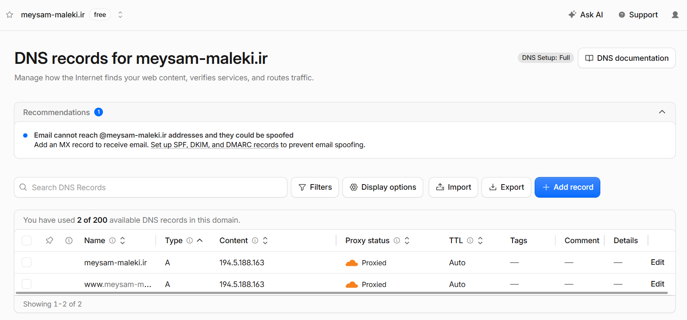
---

---
## تنظیم Cloudflare DNS برای دامنه ثبت شده در IRNIC
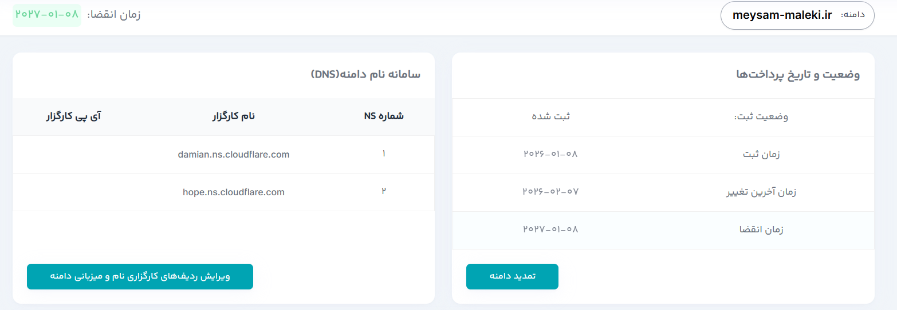
---

---
## تهیه سرور مجازی VPS از شرکت پارس پک
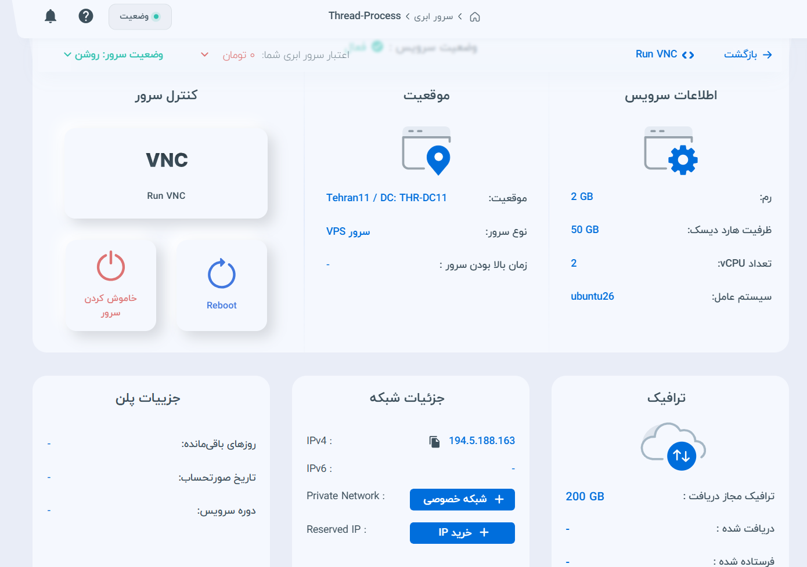
---

---
## نصب داکر روی سرور
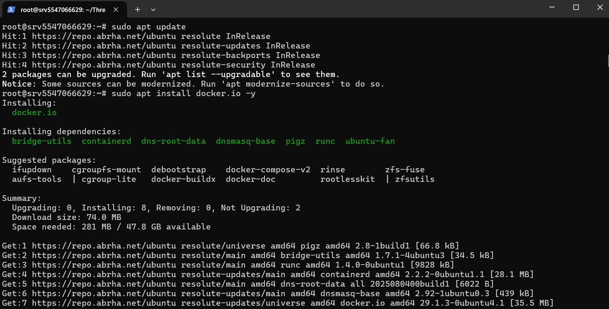
---

---
## نصب نیازمندی ها از فایل Requierments.txt
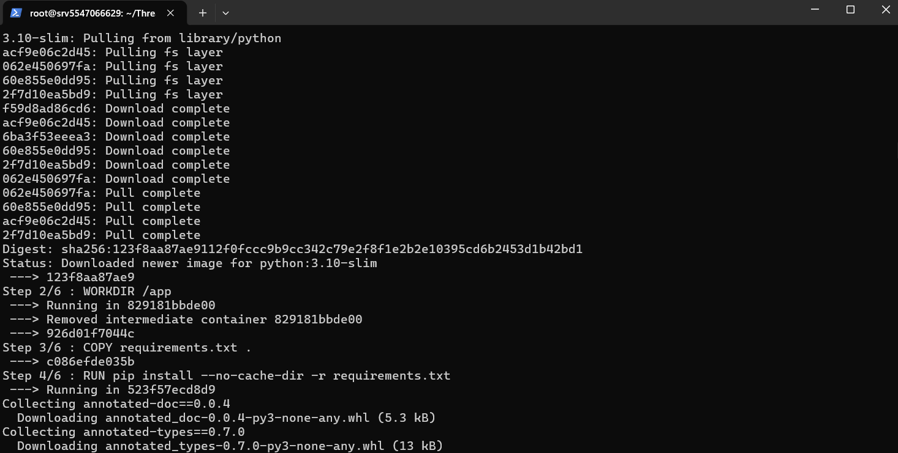
---

---
## Image ساخته شده روی سرور
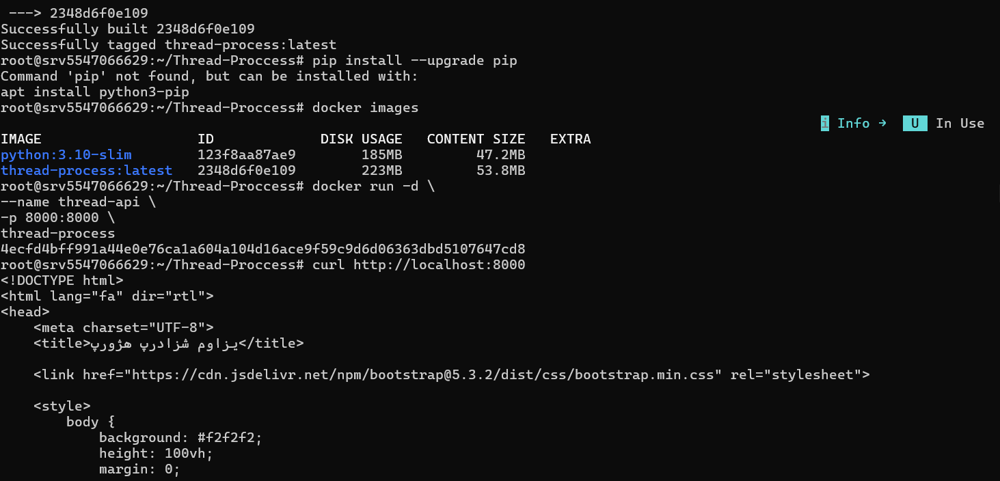
---

---
## نصب و پیکربندی nginx
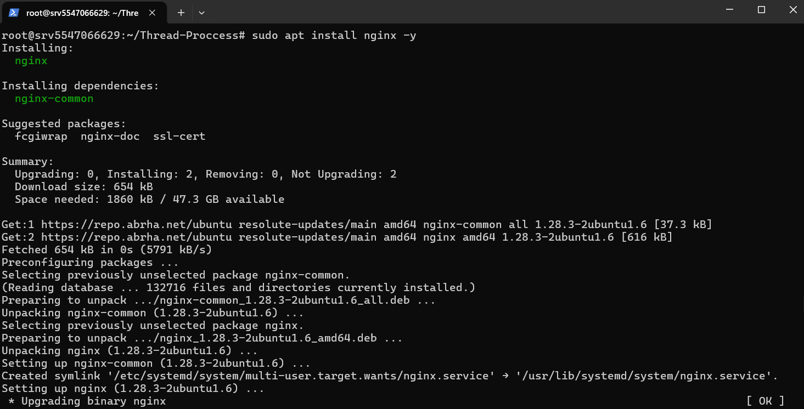
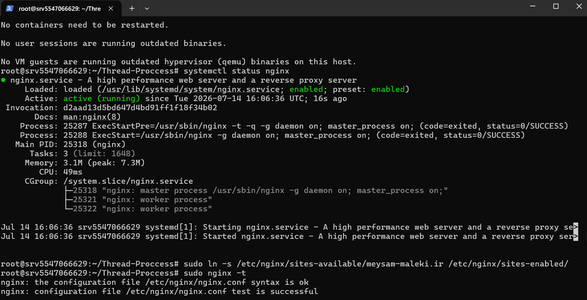
---

---
## استفاده از nginx certbot برای فعالسازی https
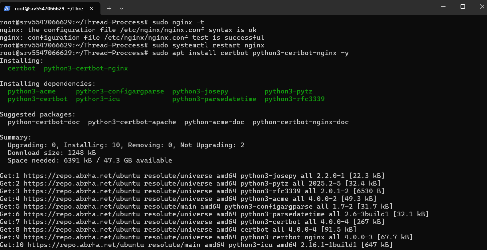
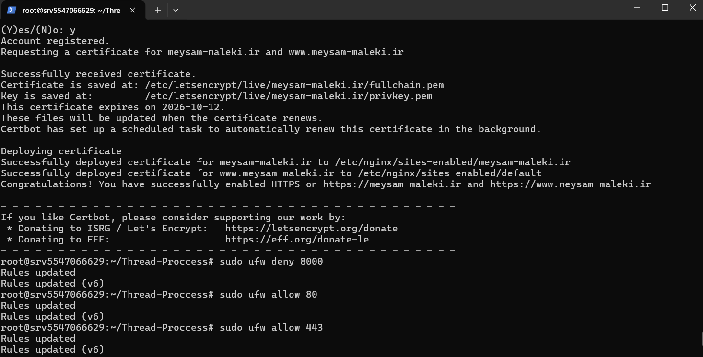
---

## فعالسازی CI/CD برای دیپلوی خودکار تغییرات روی سرور
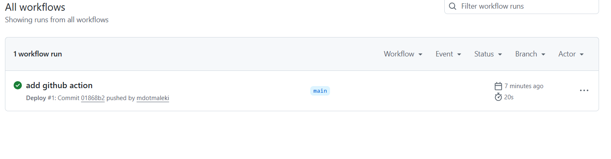
---

## ساختار پروژه

```text
Thread-Proccess/
├── main.py
├── Dockerfile
├── .gitignore
├── .dockerignore
├── templates/
│   └── index.html
└── سایر فایل‌های پروژه
```

---
## ساختار کلی دسترسی به پروژه
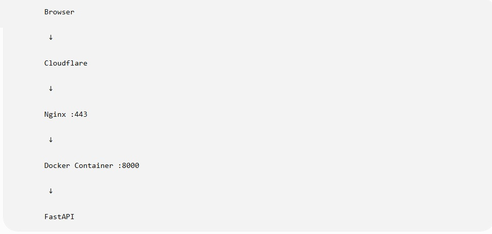
---

---
 ## پروژه نهایی
 ---

## آدرس
https://meysam-maleki.ir

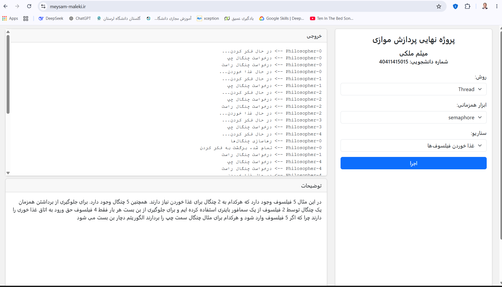

---
 ## نحوه ارسال تغییرات به GitHub
هر بار که تغییری ایجاد شد:
- git status
- git add .
- git commit -m "Description"
- git push

## تکنولوژی‌های استفاده‌شده
- Python 3.10
- FastAPI
- HTMX
- Uvicorn
- Docker
- Threading / Multiprocessing

## توسعه‌دهنده
- میثم ملکی
- شماره دانشجویی: 40411415015


